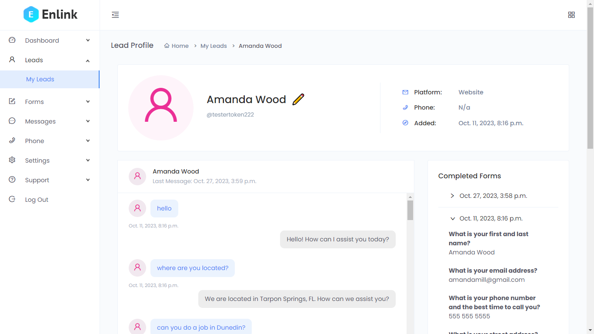
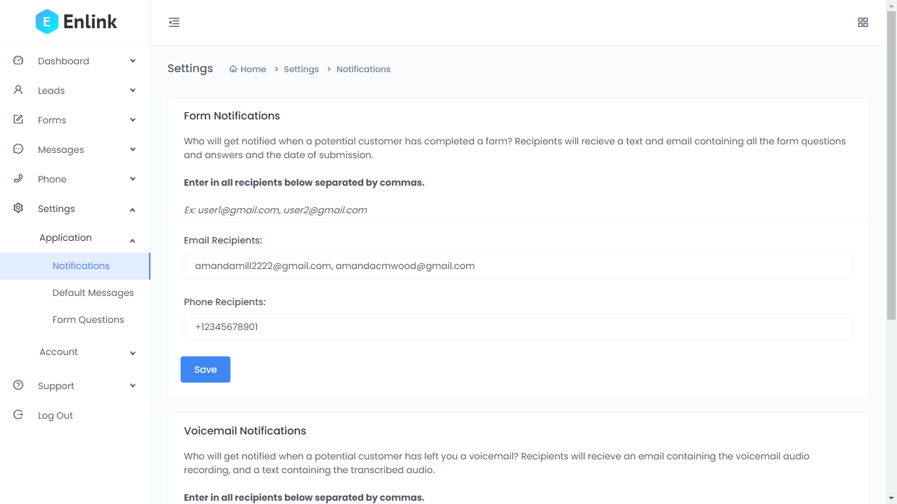
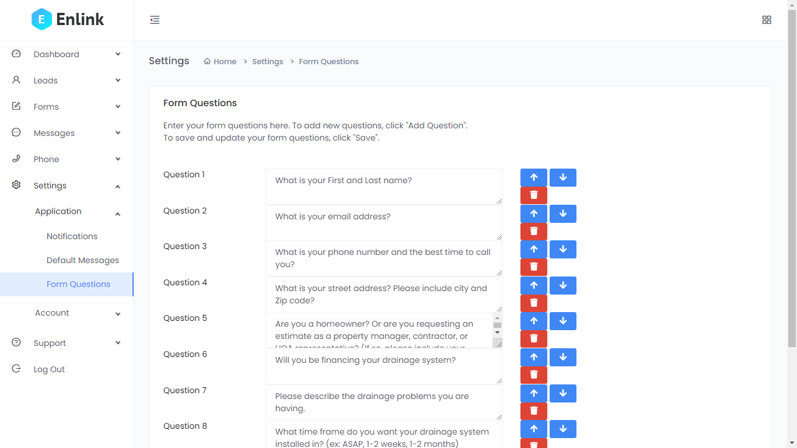
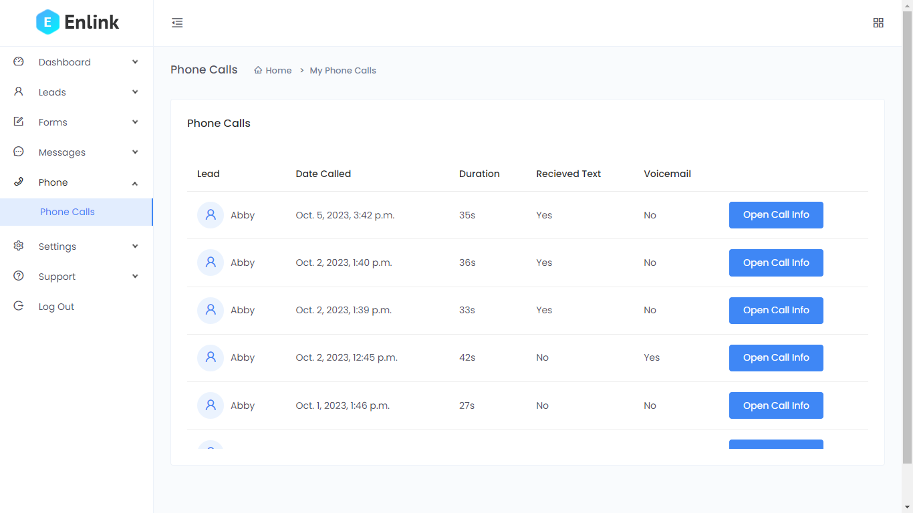

# Django Conversational AI API & Lead Management Dashboard

This project is a web application built with Django, integrating OpenAI and Twilio to deliver a robust lead management system. It includes REST APIs, a customizable dashboard, and lead capture features. This application is intended to help service-based business owners automate the process of answering incoming inquiries and collecting responses to estimate requests forms.

## Project Structure

### DjangoAPI
- **Purpose**: Contains the core project settings, ASGI/WGSI configurations, and main URLs routing.
- **Features**: Acts as the central hub for API routing, ensuring all apps are connected seamlessly.

### Dashboard
- **Purpose**: Manages the administrative interface, providing a single access point for leads, phone calls, and conversation data.
- **Features**: Offers templates and views for dashboards, account settings, and user forms.
- **Notifications & Forms**: Enables setting up notifications via email or text and customizing form questions for lead interactions.

### LeadCapture
- **Purpose**: Handles the management of leads, phone calls, and user interactions.
- **Models**:
  - **APIKey**: Manages API authentication via unique keys.
  - **Lead**: Tracks leads across various platforms.
  - **FormQuestion, Form, FormResponse**: Supports customizable forms for lead data collection.
  - **Message**: Logs all incoming and outgoing messages in a conversation history.
  - **PhoneCall**: Records phone calls and voicemail data from Twilio.

### Miscellaneous Files
- **manage.py**: Entry point for server and management commands.
- **requirements.txt**: Lists the project's Python dependencies.
- **app.log**: Log file containing application-specific logs.
- Other Python utility scripts and JSON files support various operations.

## Setup Instructions

1. **Install Dependencies**  
   `pip install -r requirements.txt`

2. **Run Database Migrations**  
   `python manage.py migrate`

3. **Set Environmental Variables**
  Edit ".env" in LeadCapture > .env

4. **Start the Development Server**  
   `python manage.py runserver`

## API Documentation - LeadCapture

### Overview
The LeadCapture app facilitates lead management and interaction through chatbots and Twilio. Using a MySQL database, Django ORM, and serializers, it provides a structured system to process messages, manage leads, collect form responses, and store phone call data.

### Key Models
- **APIKey**  
  Represents authentication for chat widgets through an API key.
  - `user`: Reference to the authorized user.
  - `key`: A unique string serving as the API key.

- **Lead**  
  Stores essential information about each lead.
  - `token`: Identifies the lead's session.
  - `platform`: Origin of the lead, either "website" or "phone."
  - `form`: Indicates if the lead is filling out a form.
  - `name`: Optional field for the lead's name.

- **FormQuestion**  
  Holds the text of each question in a form.
  - `question_text`: The question text.
  - `deleted`: Marks if the question has been removed.
  - `created_at`: Timestamp indicating when the question was created.

- **Form**  
  Contains form responses associated with a lead.
  - `user`: Foreign key to the Lead model.
  - `datetime`: When the form was filled out.
  - `questions`: Many-to-many relationship with FormQuestion through the FormResponse model.

- **Message**  
  Manages messages exchanged between the chatbot and leads.
  - `user`: Foreign key to the Lead model.
  - `datetime`: When the message was sent or received.
  - `message`: Content of the incoming message.
  - `response`: AI-generated response.
  - `form`: Boolean indicating if the message relates to a form.

- **FormResponse**  
  Links form questions to a specific form and stores user responses.
  - `form`: Foreign key to the Form model.
  - `question`: Foreign key to the FormQuestion model.
  - `response`: Textual answer given by the lead.

- **PhoneCall**  
  Captures information about phone calls made by leads.
  - `from_field`: Source of the call (typically phone number).
  - `call_sid`: Unique identifier for the call.
  - `datetime`: When the call was made.
  - `receive_text_field`: Indicates if the lead opted to receive text messages.
  - `lead`: Reference to the lead associated with the call.

### Workflow
- **Chatbot Integration**  
  Incoming messages from a chatbot are linked to leads via tokens. New leads are created if it's their first message, while existing conversations are continued otherwise. Messages are stored for each lead, and conversation history is retrieved for accurate responses.

- **Form Management**  
  If the chatbot detects the keyword "form," it starts gathering answers to form questions, updating the Lead object to reflect this. Responses are stored via FormResponse and linked to FormQuestion.

- **Twilio Integration**  
  The app receives incoming SMS messages and phone calls from Twilio, saving them under the PhoneCall model. It also manages voicemail messages and offers to send text messages to callers.

All collected data is viewable within the dashboard, providing a comprehensive overview of interactions.

## Dashboard App

The Dashboard app provides a unified interface for managing notifications, visualizing phone call details, customizing lead display information, and creating form questions. It complements the LeadCapture app by organizing and presenting relevant data for business owners. Here's an outline of its models and features:

### Key Models
- **Notifications**  
  Stores contact information for notifying the business about new voicemails or form submissions.
  - `voicemail_email`, `voicemail_phone`: Email and phone contacts for new voicemail alerts.
  - `form_email`, `form_phone`: Contacts for form submission notifications.
  Users can configure these in Notification Settings within the dashboard.

- **DefaultResponse**  
  Contains predefined response messages for phone call interactions.
  - `first_message`: Text message sent when a user opts to receive text communications via Twilio.  
    *Example*: "Hi! This is an assistant for {Company Name Here}. Feel free to ask any questions, or say 'form' to begin filling out an estimate request!"
  - `estimate_complete_message`: Text message sent when a user completes an estimate form.  
    *Example*: "Thank you for filling out this form, we will be in touch with you as soon as possible!"

  Business owners can customize these messages to maintain a consistent customer experience.

- **PhoneCallInfo**  
  Provides additional details about a phone call that may not be immediately available upon the call's completion.
  - `duration`: Duration of the phone call in seconds.
  - `voicemail`: Boolean indicating if a voicemail was left.
  - `voicemail_link`: URL of the voicemail recording.
  - `call_num`: Foreign key linking to the PhoneCall model from LeadCapture.

  This separation allows delayed processing of voicemail data when necessary.

- **LeadDisplay**  
  Offers a customizable and visually distinct representation of each lead.
  - `color`: Color assigned to the lead's icon.
  - `name`: A user-friendly name for the lead.
  - `lead`: Foreign key linking to the Lead model from LeadCapture.

  This information is purely cosmetic but provides flexibility to display meaningful labels for each lead. The default naming convention is "Lead #{lead.pk}" unless customized.

### Features

- **Form Builder**  
  The dashboard includes a form builder (implemented in JavaScript), enabling users to:
  - Update form questions
  - Rearrange them as needed

- **Data Visualization**  
  The dashboard presents all collected data associated with leads, including:
  - Chat conversations
  - Phone calls and voicemails
  - Form submissions

  This ensures business owners can easily access and manage their interactions with each lead through an intuitive chat-style window.

  
  
  
  

## License

This project is not licensed for distribution or production use. It has been created solely for demonstration purposes.
